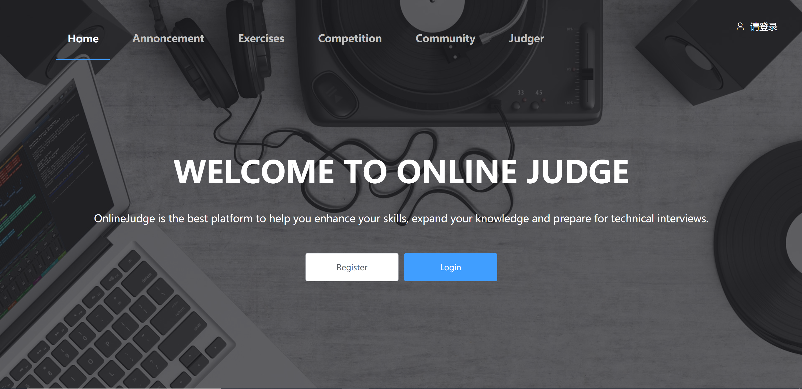
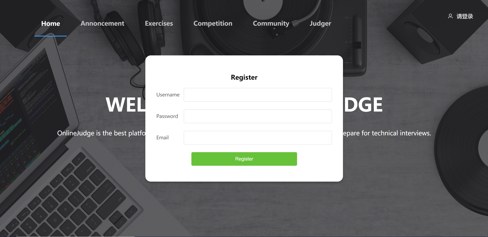
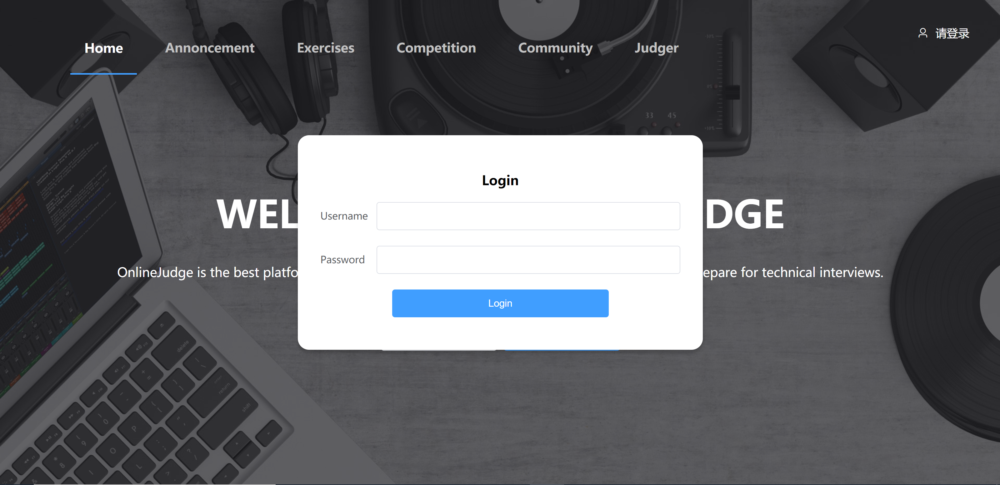
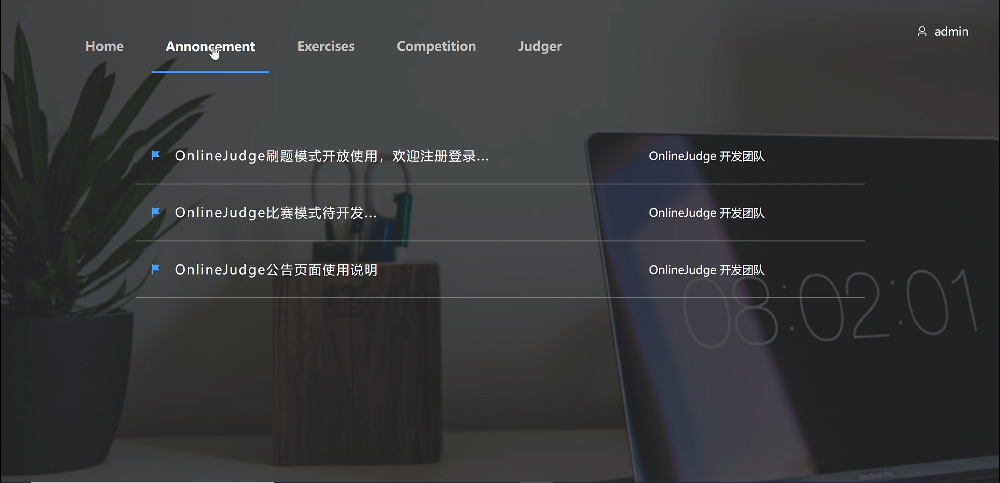
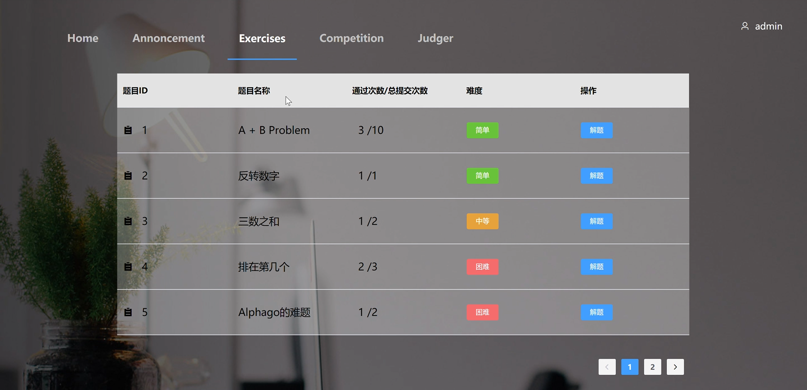
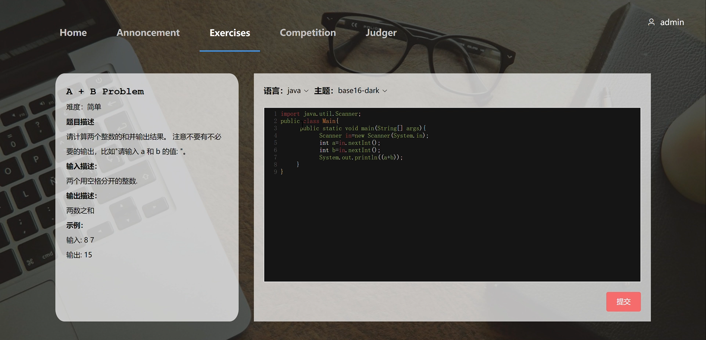
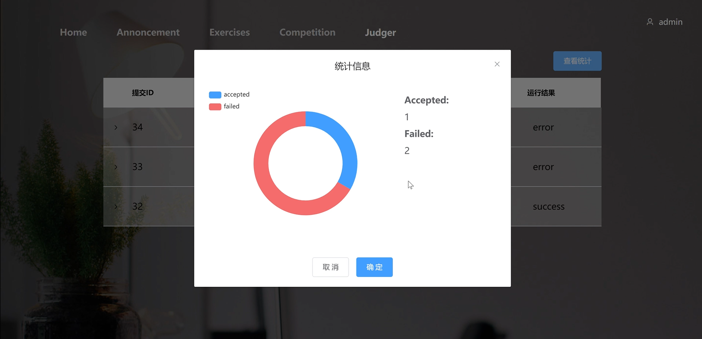

# OnlineJudgeFE

> A Vue.js project

## Build Setup

``` bash
# install dependencies
npm install

# serve with hot reload at localhost:8080
npm run dev

# build for production with minification
npm run build

# build for production and view the bundle analyzer report
npm run build --report
```

For a detailed explanation on how things work, check out the [guide](http://vuejs-templates.github.io/webpack/) and [docs for vue-loader](http://vuejs.github.io/vue-loader).

#### 页面效果

##### 首页



##### 注册



##### 登录



##### 公告页



##### 题目列表



##### 解题页面



##### 个人统计



